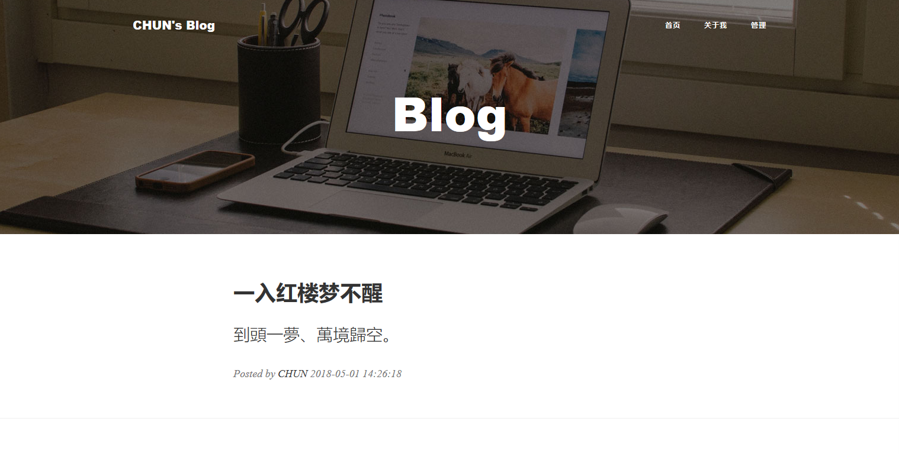
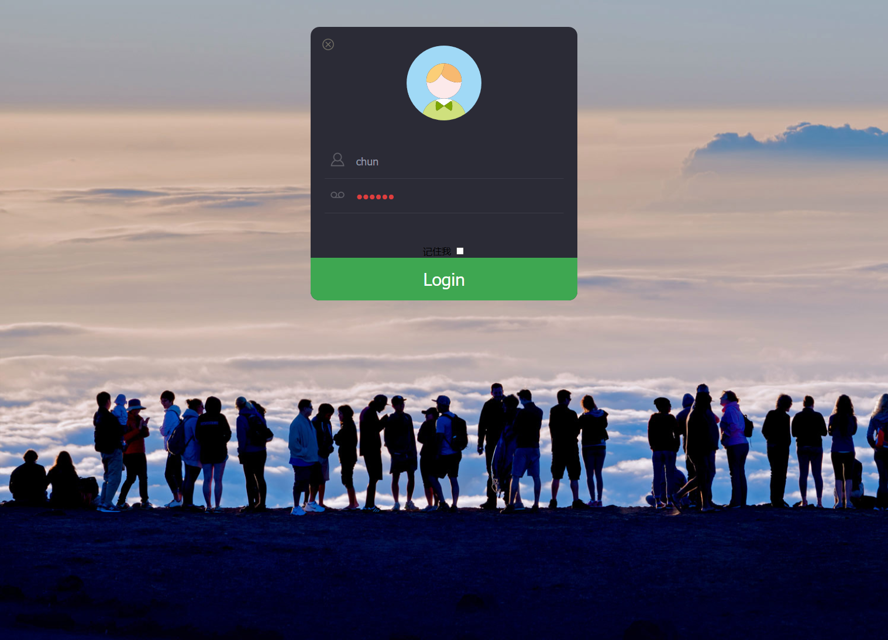
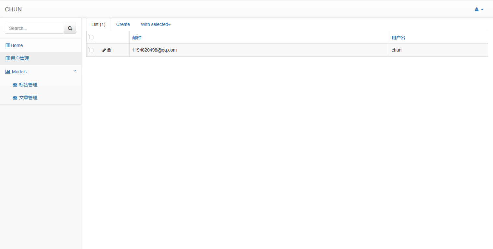

flask blog
===
a simple blog

Requests
---
     alembic==0.9.9
     async-timeout==2.0.1
     chardet==3.0.4
     click==6.7
     Flask==1.0.1
     Flask-Admin==1.5.1
     Flask-Login==0.4.1
     Flask-Migrate==2.1.1
     Flask-Script==2.0.6
     Flask-SQLAlchemy==2.3.2
     Flask-WTF==0.14.2
     idna==2.6
     idna-ssl==1.0.1
     itsdangerous==0.24
     Jinja2==2.10
     Mako==1.0.7
     MarkupSafe==1.0
     multidict==4.3.1
     python-dateutil==2.7.2
     python-editor==1.0.3
     six==1.11.0
     SQLAlchemy==1.2.7
     Werkzeug==0.14.1
     WTForms==2.1
     yarl==1.2.0

Quick start
---
1. python generate.py db init
2. python generate.py db migrate
3. python generate.py db upgrade
4. python manage.py runserver
5. Visit: http://127.0.0.1:5000/

ScreenShot
---

